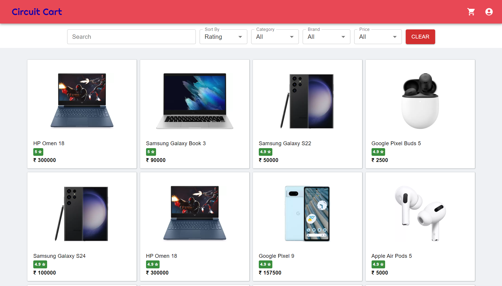
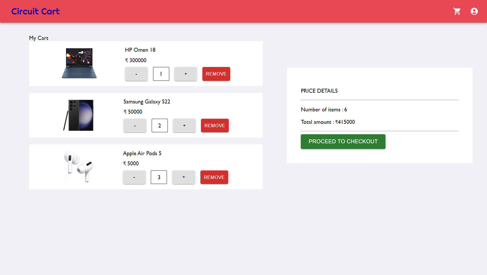
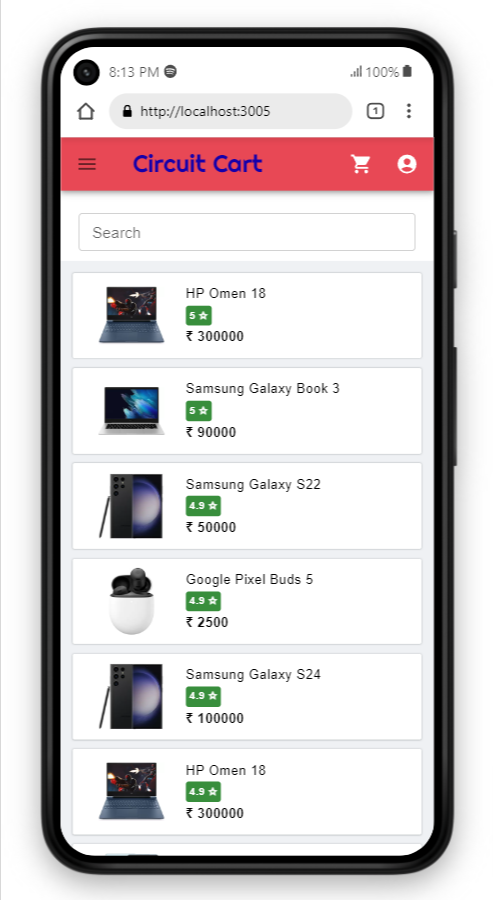
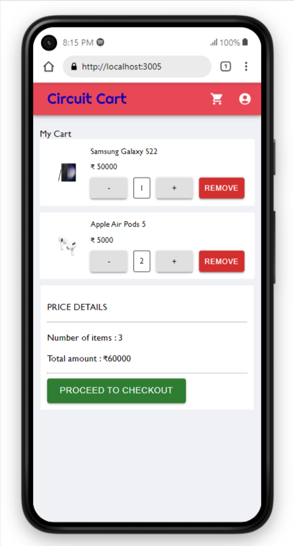

# Circuit Cart

## Description

An E-Commerce full-stack application made with React and Express.

## Demo

[Circuit Cart](https://circuit-cart.onrender.com/)

## Tech Stack

frontend

- React
- Redux
- React-Router
- MUI

backend

- Express
- MongoDB
- Node.js

## Features

- User authentication with JWT
- Responsive
- Product filtering with redux

## How to run

- Clone the repo
- Install dependencies

```#!/bin/bash
cd backend
npm install
cd ..
cd frontend
npm install
```

backend

- `cd backend`
- create .env file and enter your mongodb uri and port
- `npm start` to run in production mode
- `npm run dev` to run in development mode
- `npm test` for running tests
- you can use this [script](https://github.com/naseefmw/fake_products_data) to create sample product data.
- Enter product data by making a POST request to /api/products or use MongoDB Compass

frontend

- `cd frontend`
- `npm run dev` to run
- it will be live on `http://localhost:5173`

## Screenshots






